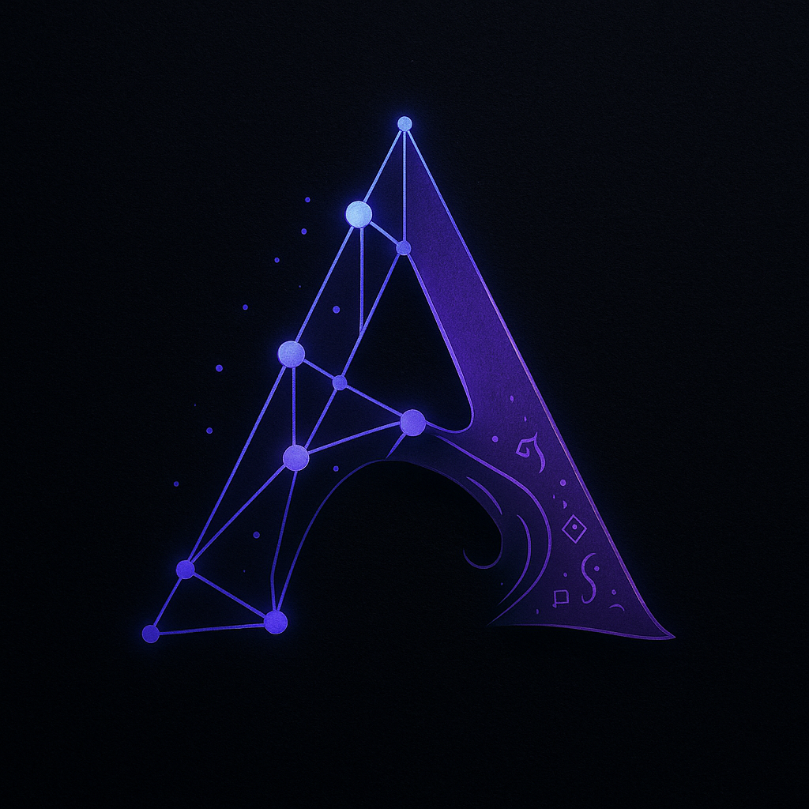

<p align="center">
  
</p>

# 🤖 ACOLYTE - Your Local AI Programming Assistant

### 🔴 PRE-ALPHA SOFTWARE - NOT READY FOR USE

[](https://www.python.org/downloads/)
[](LICENSE)
[]()
[]()

> ⚠️ **IMPORTANT: Current Project Status - Pre-Alpha**
>
> ACOLYTE is currently in **Pre-Alpha** stage. While the codebase is complete with 3,900 unit tests and 93% coverage, the system has **NEVER been fully tested or deployed**.
>
> 📄 **See full status in [STATUS.md](STATUS.md)**

---

**ACOLYTE** is not just another coding assistant. It’s your personal, local **AI engineer** — with infinite memory, full project awareness, and deep technical reasoning.

### 🧠 Why ACOLYTE?

- 🔁 **Remembers everything** – forever. Across files, sessions, and tasks.
- 🌌 **Understands your entire codebase** – not just opened files.
- 💭 **Dreams while you rest** – detects bugs, bottlenecks, and refactors on its own.
- 🧩 **Auto-indexes 31 languages** using real ASTs (Tree-sitter, not regex).
- 🛠️ **Fixes and suggests** based on Git fatigue, patterns, and historical changes.
- ⚡ **Optimized for 3B–7B models** – runs locally, even on laptops.
- 🔒 **100% Private** – never connects to external APIs or cloud services.
- 🧪 **OpenAI-compatible API** – plug it into your tools right now.

**ACOLYTE is like having a full-stack co-developer who never forgets, rarely sleeps (but dreams when it does), and only works for you.**

> You're not using a chatbot. You're deploying an AI engineer in your machine.

---

## 🌟 Features

- **100% Local & Private** - All data stays on your machine
- **Infinite Memory** - Remembers everything across sessions
- **Project Context** - Understands your entire codebase
- **Git Integration** - Knows file history and changes
- **Dream Analysis** - Deep code analysis during "sleep" cycles
- **Multi-Language** - Supports 31+ programming languages
- **Clean Projects** - Only adds a single `.acolyte.project` file to your repos

## 🚀 Quick Start

> ⚠️ **Note:** These instructions are theoretical and untested. The installation process has never been validated in a real environment. Proceed with caution and expect issues.
>
> **📖 For detailed step-by-step instructions, see the [Installation Atomic Flow](docs/INSTALLATION_ATOMIC_FLOW.md)**

### Installation (One Time)

**Linux/Mac:**

```bash
curl -sSL https://raw.githubusercontent.com/unmasSk/acolyte/main/scripts/install.sh | bash
```

**Windows:**

```powershell
Invoke-WebRequest -Uri https://raw.githubusercontent.com/unmasSk/acolyte/main/scripts/install.bat -OutFile install.bat
.\install.bat
```

### Usage (Per Project)

```bash
cd /path/to/your/project
acolyte init      # Configure ACOLYTE for this project
acolyte install   # Download models and setup services
acolyte start     # Start ACOLYTE services
```

## 📁 Architecture

ACOLYTE installs globally to `~/.acolyte/` and keeps your projects clean:

```
Your Project/
├── src/                    # Your code
├── package.json           # Your config
├── .git/                  # Your git
└── .acolyte.project       # Only ACOLYTE file (12 bytes)

~/.acolyte/
├── src/                   # ACOLYTE source code
├── projects/
│   └── {project-id}/      # All ACOLYTE data for your project
│       ├── config.yaml    # Configuration
│       ├── data/          # SQLite database
│       ├── infra/         # Docker services
│       └── dreams/        # Analysis results
└── global/
    └── models/            # Shared Ollama models
```

## 🛠️ Requirements

- Python 3.11+
- Docker & Docker Compose
- Git
- 8GB RAM minimum (16GB recommended)
- 20GB free disk space

## 💬 Commands

- `acolyte init` - Initialize ACOLYTE in current project
- `acolyte install` - Install services and models
- `acolyte start` - Start all services
- `acolyte stop` - Stop all services
- `acolyte status` - Check service status
- `acolyte index` - Index project files
- `acolyte projects` - List all projects
- `acolyte clean` - Clean cache and logs

## 🔧 Configuration

ACOLYTE stores configuration in `~/.acolyte/projects/{id}/config.yaml`:

```yaml
model:
  name: "qwen2.5-coder:3b" # 0.5b, 1.5b, 3b, 7b, 14b, 32b
  context_size: 32768

ports: # Auto-assigned to avoid conflicts
  weaviate: 42080 # Vector database
  ollama: 42434 # LLM server
  backend: 42000 # ACOLYTE API

dream:
  fatigue_threshold: 7.5 # When to suggest rest
  cycle_duration_minutes: 5
```

> **🔄 Multi-Project Support**: ACOLYTE automatically assigns different ports for each project. See [Multi-Project Ports](docs/MULTI_PROJECT_PORTS.md) for details.

## 🔌 API Endpoints

ACOLYTE provides an OpenAI-compatible API:

- `POST /v1/chat/completions` - Chat with ACOLYTE
- `POST /v1/embeddings` - Generate embeddings
- `GET /v1/models` - List available models
- `GET /api/health` - Health check
- `WS /api/ws/chat` - WebSocket chat

## 🐛 Troubleshooting

### "acolyte: command not found"

```bash
# Add to PATH
echo 'export PATH="$HOME/.local/bin:$PATH"' >> ~/.bashrc
source ~/.bashrc
```

### Port already in use

Edit `~/.acolyte/projects/{id}/config.yaml` and change ports.

### Model download fails

Check internet connection and Docker status:

```bash
docker ps
docker exec acolyte-ollama ollama list
```

## 🧑‍💻 Development

### Setup Development Environment

```bash
git clone https://github.com/yourusername/acolyte.git
cd acolyte
poetry install
./scripts/dev/dev.sh test    # Run tests
./scripts/dev/dev.sh lint    # Run linters
```

### Project Structure

```
acolyte/
├── src/acolyte/         # Source code
│   ├── api/            # FastAPI endpoints
│   ├── core/           # Core infrastructure
│   ├── services/       # Business logic
│   ├── rag/            # Search & retrieval
│   ├── semantic/       # NLP processing
│   └── dream/          # Deep analysis
├── scripts/            # Installation & utilities
├── tests/              # Test suite (93% coverage)
└── docs/               # Documentation
```

## 📄 License

This project is licensed under the Business Source License (BSL). See [LICENSE](LICENSE) for details.

## 🤝 Contributing

Contributions are welcome! Please read our [Contributing Guide](CONTRIBUTING.md) first.

## 🙏 Acknowledgments

- Built with [Ollama](https://ollama.ai) and [Qwen2.5-Coder](https://github.com/QwenLM/Qwen2.5-Coder)
- Vector search powered by [Weaviate](https://weaviate.io)
- Syntax analysis using [Tree-sitter](https://tree-sitter.github.io)

---

**Remember**: ACOLYTE is 100% local and private. Your code never leaves your machine.

**🔴 IMPORTANT**: This is a PRE-ALPHA release. The system is untested and likely has significant issues. It is NOT ready for any real use. We need brave testers to help validate and fix the installation and deployment process.
